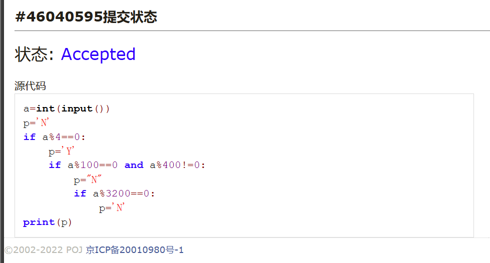
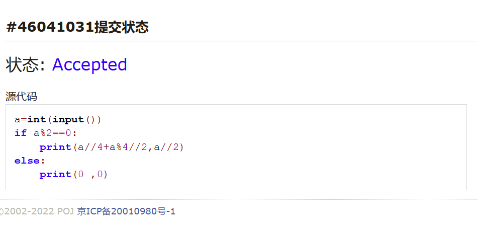
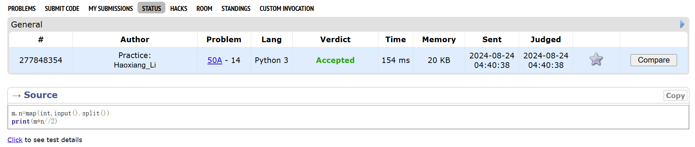
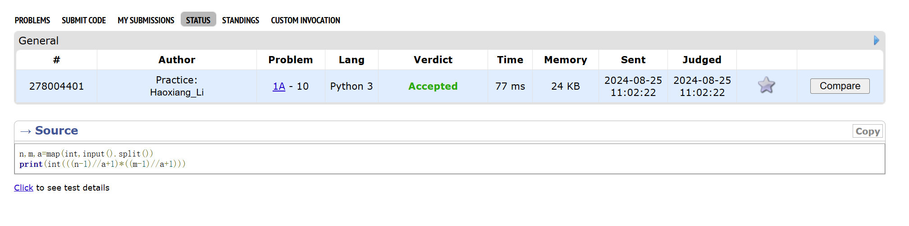
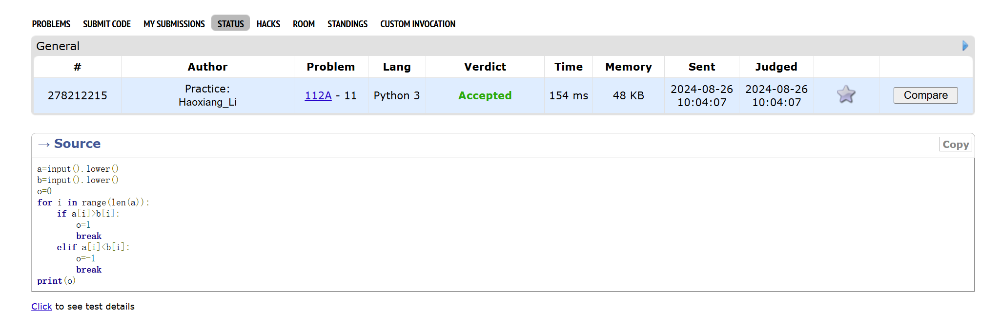
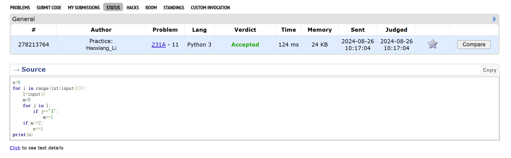

# Assignment #1: 自主学习

Updated 0110 GMT+8 Sep 10, 2024

2024 fall, Complied by 李皓翔 物院12班

## 1. 题目

### 02733: 判断闰年

http://cs101.openjudge.cn/practice/02733/


思路：

按题目所要求的，依次判断各个条件，改变p值，最后输出p

##### 代码

```python
a=int(input())
p='N'
if a%4==0:
    p='Y'
    if a%100==0 and a%400!=0:
        p="N"
        if a%3200==0:
            p='N'
print(p)
```


代码运行截图




### 02750: 鸡兔同笼

http://cs101.openjudge.cn/practice/02750/


思路：

根据题目要求编写

##### 代码

```python
a=int(input())
if a%2==0:
    print(a//4+a%4//2,a//2)
else:
    print(0 ,0)

```


代码运行截图 




### 50A. Domino piling

greedy, math, 800, http://codeforces.com/problemset/problem/50/A


思路：

多米诺骨牌最佳摆法是先横着摆满每排，若奇数列则在最后一列竖着摆，若偶数则直接完成

##### 代码

```python
m,n=map(int,input().split())
print(m*n//2)

```


代码运行截图




### 1A. Theatre Square

math, 1000, https://codeforces.com/problemset/problem/1/A


思路：

先处理横边竖边完全覆盖分别最少需要的砖数，再相乘即为答案

##### 代码

```python
n,m,a=map(int,input().split())
print(int(((n-1)//a+1)*((m-1)//a+1)))
```


代码运行截图




### 112A. Petya and Strings

implementation, strings, 1000, http://codeforces.com/problemset/problem/112/A


思路：

先将两个字符串分别改为全小写，再逐位比较

##### 代码

```python
a=input().lower()
b=input().lower()
o=0
for i in range(len(a)):
    if a[i]>b[i]:
        o=1
        break
    elif a[i]<b[i]:
        o=-1
        break
print(o)
```


代码运行截图





### 231A. Team

bruteforce, greedy, 800, http://codeforces.com/problemset/problem/231/A


思路：


##### 代码

```python
n=0
for i in range(int(input())):
    l=input()
    m=0
    for j in l:
        if j=='1':
            m+=1
    if m>=2:
        n+=1
print(n)
```


代码运行截图




## 2. 学习总结和收获

额外选做：
0901	174A. Sum	implementation	800	https://codeforces.com/problemset/problem/1742/A
1154A. Restoring Three Numbers	math	800	https://codeforces.com/problemset/problem/1154/A
0831	427A. Police Recruits	implementation	800	https://codeforces.com/problemset/problem/427/A
151A. Soft Drinking	implementation, math	800	https://codeforces.com/problemset/problem/151/A
0830	1335A. Candies and Two Sisters	math	800	https://codeforces.com/problemset/problem/1335/A
1352A. Sum of Round Numbers	implementation, math	800	https://codeforces.com/problemset/problem/1352/A
0829	1328A. Divisibility Problem	math	800	https://codeforces.com/problemset/problem/1328/A
996A. Hit the Lottery	dp, greedy	800	https://codeforces.com/problemset/problem/996/A
0828	263A. Beautiful Matrix	implementation	800	http://codeforces.com/problemset/problem/263/A
266A. Stones on the Table	implementation	800	http://codeforces.com/problemset/problem/266/A
0827	231A. Team	bruteforce, greedy	800	http://codeforces.com/problemset/problem/231/A
236A. Boy or Girl	brute force, implementation, strings	800	https://codeforces.com/problemset/problem/236/A
0826	112A. Petya and Strings	implementation, strings	800	http://codeforces.com/problemset/problem/112/A
158A. Next Round	*special problem, implementation	800	http://codeforces.com/problemset/problem/158/A
4A. Watermelong	brute force, math	800	http://codeforces.com/problemset/problem/4/A
200B. Drinks	implementation, math	800	https://codeforces.com/problemset/problem/200/B


